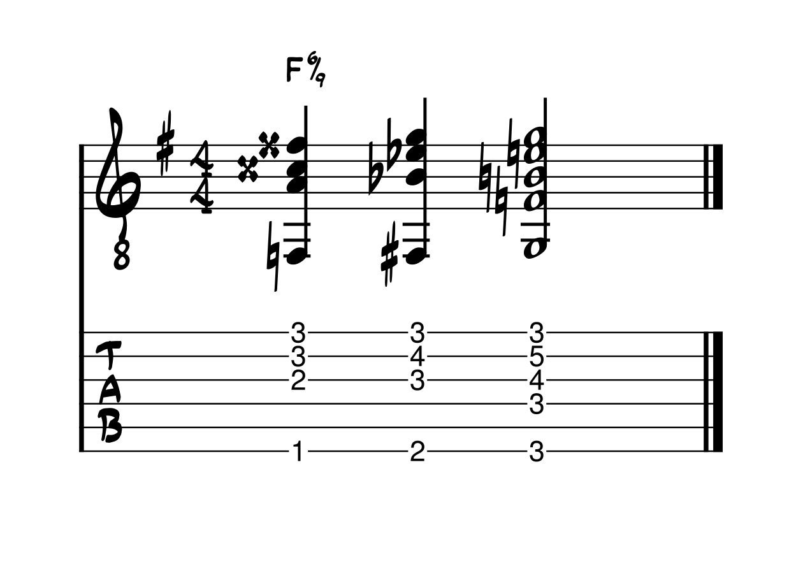

# My First Post
A sample trial post.

## $\LaTeX$
Here is an attempt to write musical notation with $\LaTeX$.

$$
\text{B}\flat6\left(\small{\sharp 5}\,^{\sharp 7}_{\sharp 9}\right)
$$

## SVG
Here is a attempt of importing a .svg music score. Can you guess the song? 

<!--https://giscus.app/-->
