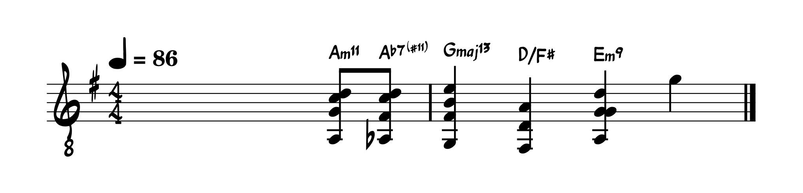

# Day 1: Happy Birthday - Walter Rodriguez Jr
In the following few posts, I will be transcribing this short clip of [Walter Rodriguez Jr](https://www.youtube.com/channel/UC5ENzBQbIGxHdjP-N1ZQgMA) playing his arrangement of the traditional tune of Happy Birthday. In each of the following posts, I will be transcribing two to three measures and analyzing them.

  <iframe src="https://www.youtube-nocookie.com/embed/zKlmrjApjlg?si=_S-EgEFcFDQ68SMQ" style="position: absolute; top: 0; left: 0; width: 100%; height: 100%;" frameborder="0" allow="accelerometer; autoplay; clipboard-write; encrypted-media; gyroscope; picture-in-picture; web-share" referrerpolicy="strict-origin-when-cross-origin" allowfullscreen title="YouTube video player"></iframe>

## Measures 1 and 2

This version of Happy Birthday is in the key of $\text{G}$ major and begins on the $\text{II}$ of the key, $\text{Am}11$. This is followed with a walking bass from $\text{A}$ to $\text{A}\flat$ with the upper structure of the chord preserved. Thus we have a $\text{A}\flat 7(\sharp 11)$. Though $\text{A}\flat 7(\sharp 11)$ is non-diatonic, its works because of the walking bass, walking in half-steps, and because of the upper chord structure, which works well with the melody.

The bass naturally works transitioning to $\text{Gmaj}11$ because of the walking bass. This appears to look like a resolution to the tonic $\text{I}$, however it sounds no where near resolved. $\text{Gmaj}11$, instead, can also be written as a $\text{D9}(\flat7)/\text{G}$ which is the $\text{V}$ in $\text{G}$ major. This denotation makes more sense in this context. The next chord $\text{D}/\text{F}\sharp$ is also still the $\text{V}$ but part of the walking bass.

This measure ends with a $\text{Em}9$ which I'm personally not sure why it works. To me it sounds like it serves a similar purpose to the $\text{V}$ chord and perhaps it is a $\text{V}$ chord on some inversion.

<!--https://giscus.app/-->
